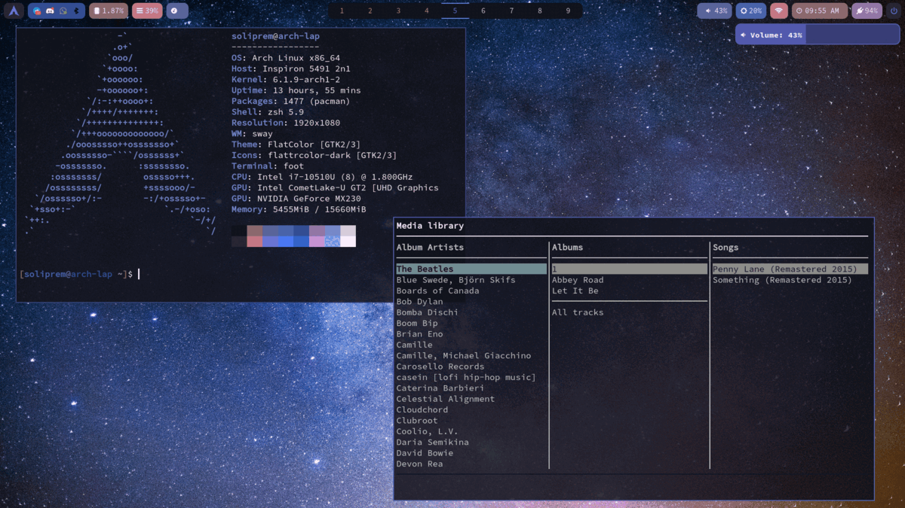
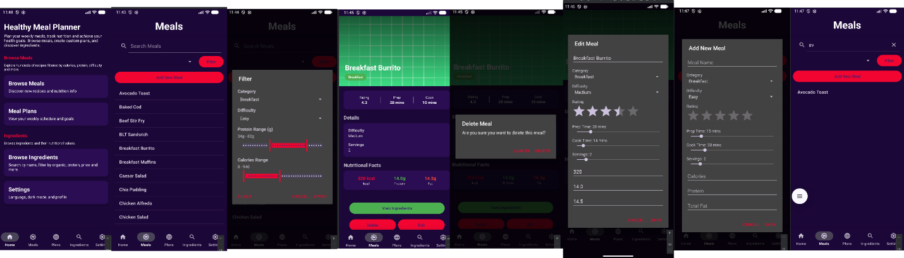

# 👋 Mark McCann

**Software Development Graduate**

📧 markmccann98@outlook.com &nbsp;|&nbsp; 📞 0851003044

---

## 🧑‍💻 About Me

**BSc. Graduate in Computing (Software Development)** — graduating May 2026 with hands-on experience building scalable applications in teams using iterative development. Passionate about testing in all forms and systems thinking. Seeking a graduate role to apply these skills in real-world environments.

I separate product relevance between *interesting*, *useful* and *meaningful*. My aim is to join the latter two into something that works with a demographic. Below is a list of projects demonstrating this — all built with correct practices: UAT, testing, iterative development, documentation. I gravitate towards supportive technologies with a focus on accessibility. Whether these are standalone apps or fused into one is a decision taken to serve the purpose of the user.

---

## 💼 Experience

### Project 1 — [Project Name]
**Role:** [Your Role]
**Tech:** [Technologies Used]

[Brief description of the project purpose and your contribution.]

---

### Project 2 — [Project Name]
**Role:** [Your Role]
**Tech:** [Technologies Used]

[Brief description of the project purpose and your contribution.]

---

### Project 3 — [Project Name]
**Role:** [Your Role]
**Tech:** [Technologies Used]

[Brief description of the project purpose and your contribution.]

---

## 🎓 Education

### Technological University — BSc. in Computing (Software Development)
**Honours** | 2023 – 2026 | 4 Years

**Relevant Coursework:**
- Advanced Algorithms in C++
- Memory Management in C++
- DevOps CI/CD Development with Agile Methodologies
- Testing & Quality Assurance
- Computational Theory
- Amazon Web Services and API Management

---

## 🏆 Certifications

| Certification | Issuer |
|---|---|
| Software Development – Distinction | Blackrock Institute |
| Machine Learning | Nvidia |
| System Administration | RedHat |
| Amazon Web Services | AWS |

---

## 🛠️ Technical Skills

| Category | Skills |
|---|---|
| **Languages** | C++, C#, Java, Python, Rust, JavaScript |
| **Cloud & DevOps** | AWS, Azure, CI/CD, RedHat |
| **ML Tools** | PyTorch, Colab |
| **Databases** | SQL, MongoDB, Oracle, Supabase |
| **Frameworks** | Django, Android Studio, FastAPI, Blazor, WinUI3, WPF |

---

## 📂 Projects & Experience

### 🖐️ Final Year Project: Ease Of Access
*Technological University*

A native accessibility platform enabling hands-free navigation and workflow automation for users with motor impairments.

**Tech:** C++, C#, WinUI3, Python, ML, PostgreSQL, Azure, Win32 API, Embedded I/O

**Core Design:**
- Built ML-driven gesture-based navigation for hands-free control
- Developed Win32 → C# interop layer for hardware I/O integration
- Deployed backend services using optimized CI/CD pipeline
- Integrated embedded I/O devices to extend system controls
- Improved task completion speed for users with impairments

**Systems Thinking:**
- **Real world applicability** — Designed for daily use and low cognitive load
- **Intelligence** — Predictive logic prevents invalid states and maintains stability
- **Ease of Use** — Unified interface supports novice → expert workflows
- **Complementary features** — Features work in tandem towards the same goal

---

### 🏥 Hackathon Winner: HSE Health App
*Technological University*

A health app proposed by the HSE to offload patient health services and reduce staff burden.

**Tech:** Django, SQLite, Azure, AWS, Python, Bash

**Core Design:**
- Built a secure patient management system with full CRUD functionality
- Created role-based access control mechanisms for secure data management
- Conducted thorough testing in deployment pipelines for reliability
- Designed optimized relational models to ensure data integrity
- Implemented rule-based AI view layer for user data for context-aware response

**Systems Thinking:**
- **Reinforcing engagement system** — Integrated positive feedback loops to encourage consistent patient use
- **Network effects** — Drive participation with a community-first design
- **Design Flow** — Natural navigation with logical movement through features
- **Scalability mindset** — Structured backend to support expansion for future services

---

## ⭐ Featured Projects

### 🖐️ Hand Gesture Desktop Control

  

For users with limited mobility who need hands-free control, and for power users who want to manipulate windows without touching a mouse or keyboard.

Real-time hand gesture recognition for Windows — Python/MediaPipe detects 7 gestures (fist, open hand, pointing, peace, pinky, swipe directions) and pipes them to a C# WinUI 3 app that maps them to 20+ desktop actions: window management, mouse control, volume, virtual desktops, copy/paste, and tiling operations. Cross-language named-pipe IPC with gesture stability logic (hold-to-fire, swipe cooldown, dominant-axis detection).

**Systems thinking:** Real-time gesture recognition is inherently noisy — a single frame misclassification would trigger false actions. A 450ms hold-to-fire window filters transient gestures, while a 1.5s cooldown after swipes prevents action avalanches. The 12-frame deque for swipe detection with dominant-axis threshold tolerates natural hand jitter without sacrificing responsiveness. This trade-off between latency and accuracy is the defining design constraint.

---

### 📐 Tiling Window Manager

  

For power users and developers who manage many open windows and want keyboard-driven spatial organization without reaching for the mouse.

Auto-tiles application windows on the primary monitor with 4 layout modes (Stacked, Column, Grid, Master-Stack). Uses raw Win32 P/Invoke (SetWindowSubclass, SetWinEventHook, IVirtualDesktopManager) for real-time retiling, focus dimming, Alt+arrow navigation, and window swapping. Extracted into a standalone engine with zero UI coupling.

**Systems thinking:** Tiling engines face a fundamental tension: retile eagerly (every create/move/close event) for responsiveness, or lazily for performance. This engine retiles eagerly but defers expensive SetWindowPos calls via subclassed window procedures rather than a global CBT hook — confining the performance impact to tiled windows only. The IVirtualDesktopManager integration further scopes operations to the current virtual desktop, preventing unnecessary work on desktops the user isn't viewing.

---

### ⌨️ Global Key Remapper

  

For users with motor impairments who benefit from simplified key layouts, and for power users who want custom shortcuts beyond what applications expose.

Full keyboard shortcut reprogramming engine — capture any modifier+letter combo and assign it to launch apps or trigger actions. Low-level WH_KEYBOARD_LL hook with a live on-screen keyboard overlay that color-codes every key in real-time (red = taken, green = free, orange = held). Built from scratch — no AutoHotkey dependency.

**Systems thinking:** A global key remapper must intercept keystrokes before the target application sees them, but the on-screen overlay also needs to display key state without intercepting those same keystrokes. The solution: two independent WH_KEYBOARD_LL hooks — one for the hidden remapper engine, one for the overlay UI — with a shared KeyDictionary so the overlay can render state without competing for the input stream. Separating read (overlay) from write (remapper) at the hook level avoids a circular dependency deadlock.

---

### 🖱️ Keyboard-Driven Mouse (Mouseless)

  

For users who cannot use a physical mouse due to motor impairment, and for power users who want to stay entirely on the keyboard during focused work.

Drives the Windows cursor entirely from the keyboard at 60 FPS. Velocity/friction physics model: short taps make pixel-precise steps, holding produces smooth gliding — no jittery key-repeat stutter. Three speed presets. Separate WH_KEYBOARD_LL hook + System.Threading.Timer at 16ms intervals.

**Systems thinking:** Naive keyboard mouse control uses key-repeat rate — hold an arrow key and the OS repeats the key at ~30Hz with a 500ms initial delay, creating jerky, unpredictable cursor movement. Instead, this builds a velocity accumulator: key-down adds acceleration, key-up applies friction damping. The 16ms timer polls not the key state (which would miss rapid taps) but the velocity vector, which smoothly integrates all input. The result feels like analog control from a digital input — the same principle behind game controller thumbstick emulation.

---

### 👁️ Eyesight Color Filter Overlay

For users with visual impairments — dyslexia (yellow filter improves contrast), light sensitivity (blue-light reduction), migraine (FL-41 rose tints reduce photophobia), and general screen brightness sensitivity.

Full-screen accessibility overlay with 5 visual filter modes (Dim Screen, Dyslexia warm-yellow, Light Sensitive blue-block, Migraine FL-41 rose, Fire animated). Click-through WS_EX_LAYERED | WS_EX_TRANSPARENT window with LWA_ALPHA compositing. 3 strength levels. Smart Assistant integration for timed activation.

**Systems thinking:** An overlay must be invisible to the user's interactions — click-through, never stealing focus, never registering input. WS_EX_TRANSPARENT alone doesn't guarantee this in Win32; the window must also not appear in EnumWindows results for certain operations. Using WS_EX_LAYERED with LWA_ALPHA separates visual compositing from input routing entirely. The 3 strength levels aren't linear — Dim Screen adjusts a continuous alpha while color modes blend a second layered bitmap — because a brightness slider and a color intensity slider are physically different operations that happen to share a UI control.

---

### 📋 Commands Snippet Palette

For developers and terminal-heavy power users who want instant access to git/dotnet/npm/PS commands without memorizing syntax or leaving their flow.

Speed-launcher overlay (Ctrl+Alt+O) with searchable git/dotnet/npm/PS snippets. Copies to clipboard with optional auto-paste via keybd_event. Usage tracking with dynamic "most used" sorting and numeric shortcuts with 400ms digit-buffer timer.

**Systems thinking:** The digit-buffer timer exemplifies a design choice between responsiveness and ambiguity. When the user presses [1], the system must wait — how long? — to distinguish between "select command 1" and the start of "12". A 400ms buffer captures quick double-digits while feeling instant for single-digit selections. The auto-paste feature via keybd_event raises a deeper trade-off: it assumes the clipboard is yours to overwrite. Saving and restoring clipboard contents around the paste would protect the user but introduces race conditions with other clipboard-writing apps. This feature opted for speed over safety, with a clear toggle to disable auto-paste entirely.

---

### 🌐 ASP.NET Core Web API — College Assignment A1 Grade 

  

Built and deployed a RESTful API from scratch using ASP.NET Core with a code-first EF Core approach, one-to-many relationships, full CRUD + search across three tables (Ingredients, Meals, Plans), and internationalisation (Irish + Spanish). Consumed by a Java Android client via Retrofit.

**Tech:** C#, ASP.NET Core 8, Azure App Service, Azure SQL, Entity Framework Core, GitHub Actions CI/CD, API Management, Retrofit

**Deployment:** Azure App Service with an Azure SQL database. CI/CD via GitHub Actions — builds, publishes, deploys, and imports the OpenAPI spec into API Management on every push. Security via environment variables and SQL authentication.

**Android Client:** Java app with modular `*Api` classes (e.g. `IngredientsApi`) and central `RetrofitClient`. Navigation, forms, search/filter, and internationalisation tested with Espresso on physical devices.

---

## 🧩 Smaller Projects

### 🤖 Smart Assistant
Timed automation engine that schedules accessibility feature activation on configurable rules with EnumWindows-based window counting. Useful for users who want features to activate automatically (e.g., Dim Screen at sunset).

**Systems thinking:** The 60-second polling interval balances battery life against responsiveness. A once-per-day guard per rule prevents re-firing — notable because DateTime.Date comparison fails if the app runs across midnight while the timer is sleeping.

### ☁️ Supabase Roaming Settings
Cross-device settings sync with auth (signup/login). Useful for users who work on multiple machines.

**Systems thinking:** Roaming settings sound simple but introduce conflict resolution — last-write-wins is naive but acceptable for boolean toggles where concurrent modification is unlikely. The coupling is one-directional: cloud → local on login, local → cloud on toggle change, with no merge logic, because accessibility settings are personal preferences, not collaborative documents.

### 🔗 Central Hotkey Hub
Dispatches 15 global hotkeys to feature toggles via Win32 message pump. Useful as the architectural backbone ensuring features don't fight for hotkey real estate.

**Systems thinking:** Centralizing all RegisterHotKey calls in one HWND avoids ID collisions between features. The 1000/2000 range convention isn't cosmetic — RegisterHotKey uses atomic IDs, and without namespacing, two features requesting the same ID silently fails.

